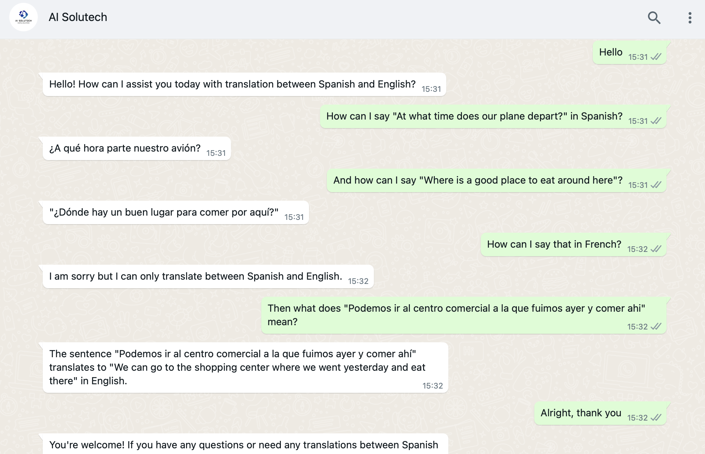
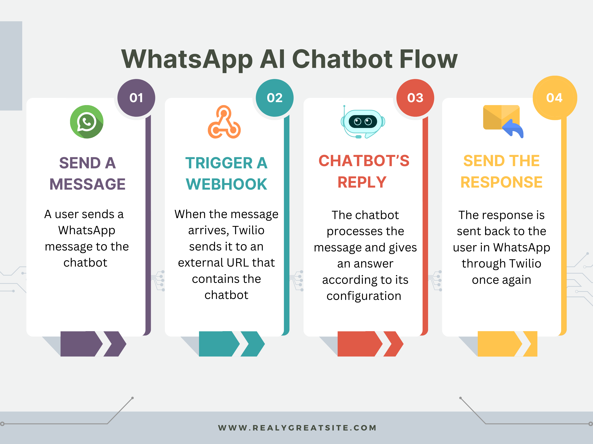
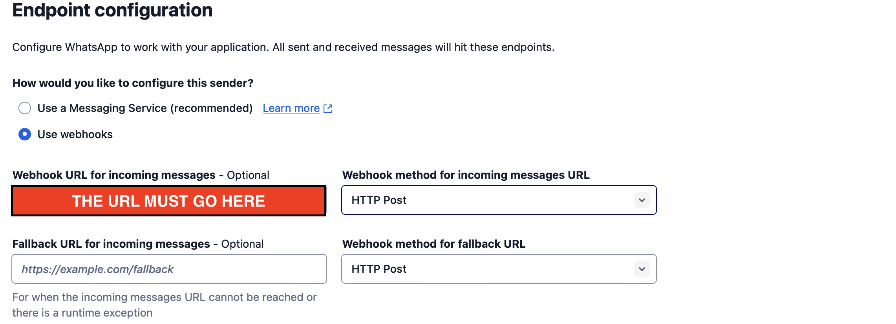

# WhatsApp Chatbot

## Introduction

Whatsapp Chatbot is a Python application that integrates an AI chatbot into an already well-known and widely used mobile application, which in this case is WhatsApp. For this particular example, the chatbot was named "AI Solutech", and it was configured to act as a translator between Spanish and English. Thus, the chatbot is only going to answer questions related to translation between Spanish and English and no other type of questions.

<div align="center">
    
</div>

## Description

The chatbot itself is programmed entirely in python, but in order to connect it to Whatsapp a third party called Twilio that already focuses on doing such things was used. In general terms, the application works in the following way:

<div align="center">
    
</div>


1. SEND A MESSAGE: The user sends a simple whatsapp message to the whatsapp contact that belongs to the chatbot.

2. TRIGGER A WEBHOOK: When Twilio detects that a message has arrived, it triggers a predefined webhook that contains the chatbot's source code where the chatbot will answer according to the user's message and the way that it was configured.

3. CHATBOT'S REPLY: The chatbot processes the user's message and gives a reply in relation to it. In this case, the chatbot was configured so that it only acts as a Spanish and English translator. Therefore, if the user sends a message asking a question that is not related to Spanish and Enlgish translation, the chatbot replies by explicitly saying that it can only translate between Spanish and English.

4. SEND THE RESPONSE: Once the chatbot's response is ready, Twilio sends it to the whatsapp user.

## Use this particular chatbot that I created

In order to use this particular chatbot, the user can send a whatsapp message to the following phone number: +52 81 4173 5898

The steps to use it are the following:

1. Save the phone number as a contact to the phone.
2. Open whatsapp and search for a contact.
3. You are ready, begin a conversation.

## Use the chatbot by configuring it according to one's needs

To achieve this, there are additional steps that must be taken besides only configuring the chatbot. I will first explain how to configure the chatbot and after that talk about the additional steps. 

1. The chatbot's configuration must be modified by the following way:

    A. Clone this repository to your local machine
    
    B. Install the required libraries through the following command:

    ```bash
    pip install -r requirements.txt
    ```

    C. Open the `app.py` and go to the following part: 
    ```bash
    #Configure the chatbot
    chat_history = [ {"role": "system", "content": "You are going to be a chatbot whose only task is\translating text from spanish to english or viceversa. Any question or query that\is not related to translation between spanish and english reply by saying:\I am sorry but I can only translate between spanish and english."} ]
    ```
    In this section, everything after comes after "content" is the chatbot's configuration. Therefore, one can simply modify the "content" in order to configure the chatbot according to one's needs.

2. Host the app by deploying it on a local web app. There are many options available for this, and some of the platforms that can be used are the following:

    A. [Python Anywhere](https://www.pythonanywhere.com)
    
    B. [Heroku](https://www.heroku.com)
    
    C. [DigitalOCean](https://www.digitalocean.com)

    Once hosted, the application will be accesible from anywhere through a URL that will be assigend by the hosting platform. This URL will be needed on the last step!

3. Then, a Twilio account must be setup in order to connect the chatbot to a WhatsApp number. All the steps needed to do this can be found in the Twilio documentation. A good place to start with the documentation is the following: [Twilio WhatsApp Configuration](https://www.twilio.com/docs/whatsapp/tutorial/requesting-access-to-whatsapp)

4. Finally, once the Twilio account is ready the URL obtained in step 2 must be inserted to the Twilio WhatsApp number's settings. The URL must be inserted on the following space:

<div align="center">
    
</div>

5. Congratulations, the personalized WhatsApp chatbot is now ready to be used!

## Contributions

This application was made as a personal project and does not accept contributions. However, users can feel free to clone the repository and use or modify it according to their own needs.

## License

This project is under the terms of the [MIT license](https://opensource.org/license/mit/)